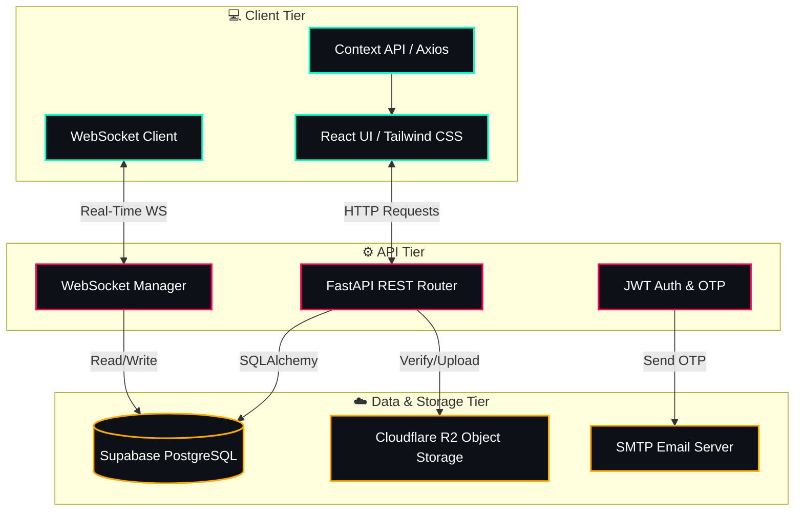
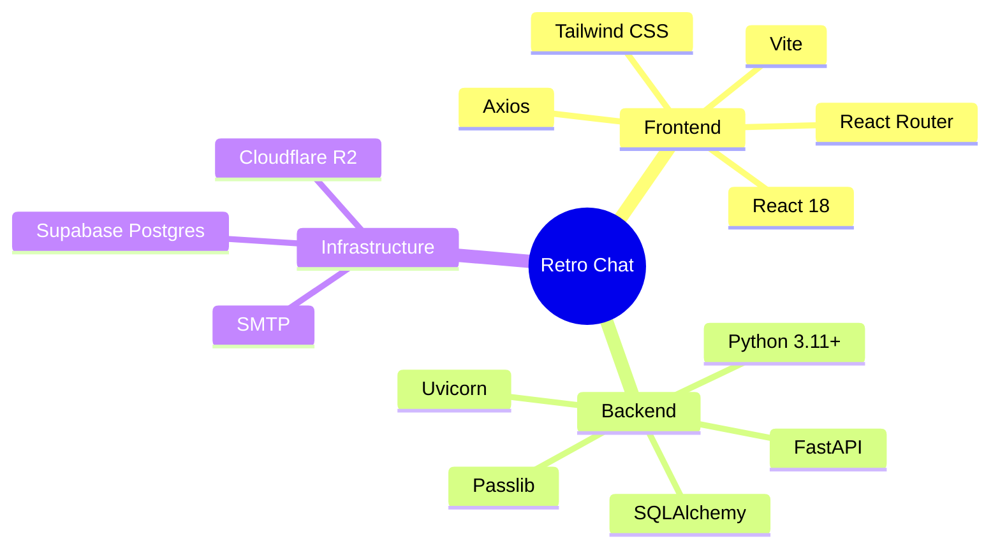
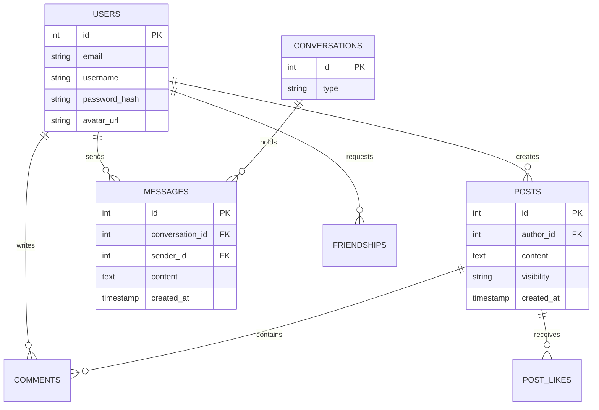

<div align="center">
  <br />
  
  <br />
  
  <h1 style="font-size: 3rem; font-weight: bold; margin-bottom: 0;">RETRO CHAT</h1>
  
  <a href="https://git.io/typing-svg"></a>


  <p align="center">
    <strong>FastAPI • React • Supabase • WebSockets • Cloudflare R2</strong>
    <br />
    <br />
    <a href="#-architecture">Architecture</a>
    ·
    <a href="#-features">Features</a>
    ·
    <a href="#-tech-stack">Tech Stack</a>
    ·
    <a href="#-getting-started">Getting Started</a>
  </p>
</div>

---

## 🌌 The Vision

**Retro Chat** is a highly scalable, real-time chat and social blogging platform engineered with modern performance and clean aesthetics in mind. Bypassing algorithmic feeds and engagement hacks, it delivers a pure chronological, authentic social experience.

---

## 📐 Architecture Wireframe



---

## ⚡ Features

### 💬 Real-Time Chat Engine

* **WebSockets:** Lightning-fast, instant message delivery.
* **Read Receipts:** Track when messages are delivered and read.
* **Typing Indicators:** See when friends are actively typing.

### 🌐 Social Blogging (The Feed)

* **Chronological Feed:** No algorithms. Pure chronological posts.
* **Engagement:** Like, save, and comment on posts.
* **Content Management:** Pin your favorite replies (up to 3) to the top of your posts.

### 🔐 Ironclad Security & Auth

* **OTP Verification:** Email verification codes required for registration and password resets.
* **JWT Tokens:** Stateless, highly secure session management.
* **Privacy-First:** Usernames are hidden globally until a friend request is accepted.

### 🖼️ Modern Media & Storage

* **Cloudflare R2 Integration:** Avatars and media assets are stored safely on the edge.
* **Responsive Design:** 100% responsive fluid UI built meticulously with Tailwind CSS and glassmorphism elements.

---

## 🛠️ Tech Stack



---

## 📂 Project Structure

```text
RETRO-CHAT/
├── backend/                       # Python FastAPI Server
│   ├── app/
│   │   ├── core/                  # Security & Config
│   │   ├── db/                    # Postgres setup & migrations
│   │   ├── models/                # SQLAlchemy database tables
│   │   ├── routers/               # API endpoint definitions
│   │   ├── schemas/               # Pydantic data validation
│   │   └── services/              # Business logic & email sending
│   ├── main.py                    # Server entrypoint
│   └── requirements.txt           # Python dependencies
│
├── frontend/                      # React Vite Application
│   ├── public/                    # Static assets (including logo)
│   ├── src/
│   │   ├── assets/                # Images and SVGs
│   │   ├── components/            # Reusable UI components
│   │   ├── context/               # Global state (Auth, WebSockets)
│   │   ├── pages/                 # Full screen route views
│   │   ├── services/              # Axios API clients
│   │   ├── styles/                # Tailwind CSS globals
│   │   ├── App.jsx                # React Router setup
│   │   └── main.jsx               # React entrypoint
│   ├── tailwind.config.js         # Theme styling configuration
│   └── package.json               # Node.js dependencies
│
├── .gitignore                     # Git ignore rules
└── README.md                      # Project documentation
```

---

## 🚀 Getting Started

### 1. Prerequisites

Ensure you have the following installed on your machine:

- **Node.js** (v18+)
- **Python** (v3.11+)
- **Git**

### 2. Clone the Repository

```bash
git clone https://github.com/yourusername/RETRO-CHAT.git
cd RETRO-CHAT
```

### 3. Backend Setup

Navigate to the backend and initialize the virtual environment:

```bash
cd backend
python -m venv venv
source venv/bin/activate  # On Windows: venv\Scripts\activate
pip install -r requirements.txt
```

Copy the environment template and fill in your secrets (Supabase, SMTP, Cloudflare):

```bash
cp .env.example .env
```

Run the FastAPI Server:

```bash
uvicorn app.main:app --reload --port 8000
```

### 4. Frontend Setup

Open a new terminal, navigate to the frontend, and install dependencies:

```bash
cd frontend
npm install
```

Copy the environment template:

```bash
cp .env.example .env
```

Start the Vite Development Server:

```bash
npm run dev
```

Navigate to `http://localhost:5173` in your browser.

---

## 📊 Database ER Diagram



<div align="center">
  <br />
  
</div>
